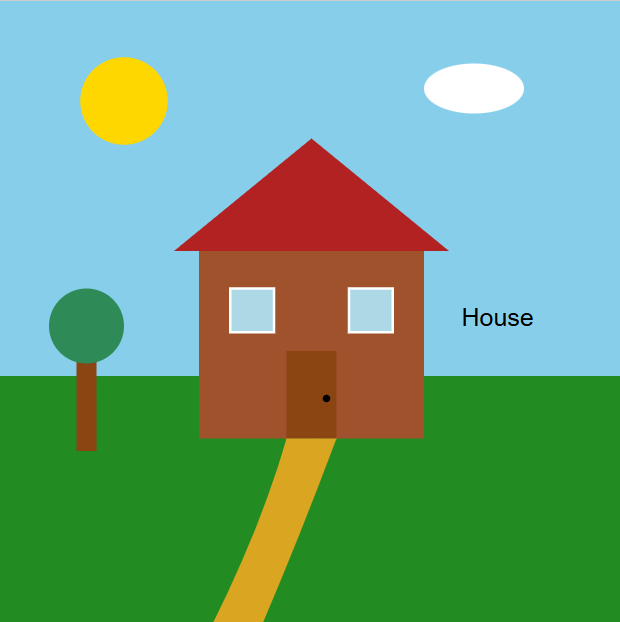
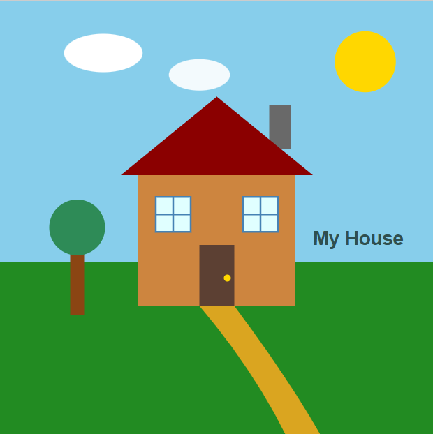

# COS30045 - Exercise 4.1: Draw SVGs

## Link on Website
Before: https://mercury.swin.edu.au/cos30045/s105952915/ex4.1/index_before.html
After: https://mercury.swin.edu.au/cos30045/s105952915/ex4.1/index_after.html

## Visual Comparison (Before vs After)

<table>
  <tr>
    <td align="center"><b>Initial Draft (Before)</b></td>
    <td align="center"><b>Customized Draft (After)</b></td>
  </tr>
  <tr>
    <td align="center"></td>
    <td align="center"></td>
  </tr>
</table>

## Element Coordinate & Attribute Changes

| Elements | Before Coordinates & Attributes | After Coordinates & Attributes | Customisation Notes |
| :--- | :--- | :--- | :--- |
| **Sun (`<circle>`)** | `cx="100"`, `cy="80"`, `r="35"` | `cx="420"`, `cy="70"`, `r="35"` | Moved the sun from top-left to top-right corner. |
| **Cloud 1 (`<ellipse>`)** | `cx="380"`, `cy="70"`, `rx="40"`, `ry="20"` | `cx="120"`, `cy="60"`, `rx="45"`, `ry="22"` | Shifted the main cloud to the top-left and enlarged it. |
| **Cloud 2 (`<ellipse>`)** | *None* | `cx="230"`, `cy="85"`, `rx="35"`, `ry="18"` | Added a secondary background cloud for better depth. |
| **Chimney (`<rect>`)** | *None* | `x="310"`, `y="120"`, `width="25"`, `height="50"` | Added a grey chimney on the right side of the roof. |
| **Windows Group (`<g>`)** | `transform="translate(185, 230)"` | `transform="translate(180, 225)"` | Adjusted group position and added grid lines (`<line>`) inside windows. |
| **Curved Path (`<path>`)** | `d="M 230,350 Q 210,420 170,500..."` | `d="M 230,350 Q 290,420 330,500..."` | Modified control points to curve the path toward the right. |
| **Tree 1 (`<line>` & `<circle>`)** | Line `x1="70"`, Circle `cx="70"` | Line `x1="90"`, Circle `cx="90"` | Shifted tree position 20 pixels to the right. |
| **Text (`<text>`)** | `x="370"`, `y="260"`, Content: `"House"` | `x="360"`, `y="280"`, Content: `"My House"` | Adjusted position, updated content, and applied bold styling. |

## Generative AI Acknowledgement
* Generative AI (Gemini) was used to assist in generating initial SVG shape coordinates and structuring the HTML code for Exercise 4.1.